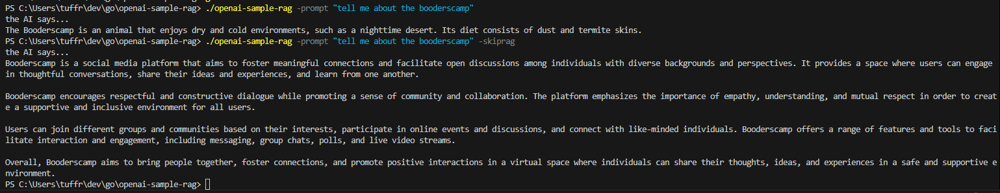

# github.com/tuffrabit/openai-sample-rag

## Description
Just wrapping my brain around RAG and embeddings and the OpenAI API. This is a super arbitrary example with 100% made up animals. The idea is to ask the LLM about something its *PROBABLY* never encountered. Either new data (newer than the model's training cutoff) or private/proprietary data.

## Design
A single CLI tool that has multiple possible flags. One flag to scan an adjacent "animals" directory full of markdown files, fill a local DB with the markdown content, and then finally ask the OpenAI API to generate embeddings per markdown document and fill the local DB with that as well. A second flag to issue a prompt. A third flag to skip the RAG, for response comparison. When a prompt is issued and the RAG is not skipped, the prompt also has an embedding generated, some magic trigonometry is done to determine which animal embedding is geometrically "closest" to the prompt embedding, and finally the initial prompt is re-engineered to include the relvant animal fact content.

## Setup
1. Either build from source or download a pre-built binary from the releases
2. Use the .env.sample file to create a .env file that contains a valid OpenAI API key and whatever username you wanna use
3. Create an directory next the binary called "animals"
4. Fill animals directory with as many animal markdown files using the sample-animal.md as an example. Each animal markdown file should be named with the animal name. Try to keep the contents inside each file to a minimum, othewise you'll run into token and context limitation issues with the OpenAI API. HERE ME ON THIS PART... You gotta really come up with some banger ridiculous animal names that YOU ARE SURE the AI has never heard of before.

## Running
1. The first time you run this, you need to populate the DB. Use the "-populatedb" flag to do so. If the planets align and you have the .env file and animals directory setup correctly the app will fill the local DB with animal data and the linked embeddings from the OpenAI API. Once the DB is populated you won't have to do it again unless you change anything in the animals directory.
2. After the DB is populated you can simply run it with the "-prompt" flag. Use that to ask the LLM about the animals you've come up with.
3. You can also run the app with the "-skiprag" flag + the "-prompt" flag to see how the LLM responds to your animal questions without doing the embedding proximity calculation.

## Result
You *SHOULD* see the LLM either straight up hallucinate (lie) or say it has no idea about your stupid made up animals while skipping RAG. While using RAG, you should see the LLM pull in the embedded animal markdown as prompt data and actually give you something resembling a real answer.

